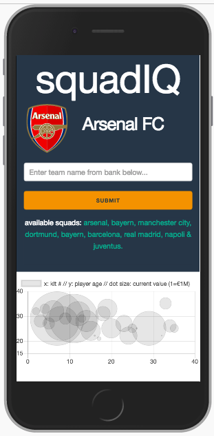

# squadIQ  
***description***: Thinkful Capstone I 
***assignment***: Soccer API with graphed analysis of squad values  
***authors***: Franklin Carvajal (@HexisHacks) + Colin Van Sickle (@cfv7) 

## ***screenshot***

## ***background***
Our motivations behind this project were threefold:
		
1) To showcase what we've learned about JS, JQ, AJAX & APIs.
2) To test correlation between interesting soccer squad metrics.
3) To make a tool that users can use to better understand avaiable soccer data.

## ***summary***
This app asynchronously draws data from http://api.football-data.org/index and produces a   
'bubble' scatter chart which is a 3 dimensional representation of several squad metrics.  
 
Using AJAX request we read through each teams players and plotted Age, Kit Number (Jersey Number),   
and Current Value (according to Transfermarkt). 
 
Generally, we found statistical significance in lower numbered players being more valuable.  
 
We plot age on the y-axis, kit number on the x-axis, and current value determing the size of the dot. 
 
The user can easily query a group of top teams we included in our object state.  
 
We are working to try and automate the process of adding teams to our object.  
 
We hope that this app can serve as a learning tool for those curious about how  
kit numbers, age, and current value factor into the DNA of their favorite squads.  

## ***technology***
HTML 
JavaScript 
jQuery 
Flexbox w/ Skeleton CSS, Media Queries. 
AJAX requests 

*Additional Libraries* 
Chart.js 

## ***future implementations***
		
- [ ] Optimize our chart.js (add color and titles)
- [ ] Improve search bar funcionality (allow capitalization and autocomplete)
- [ ] Add more teams to our object state
- [ ] Add positions as another variable

